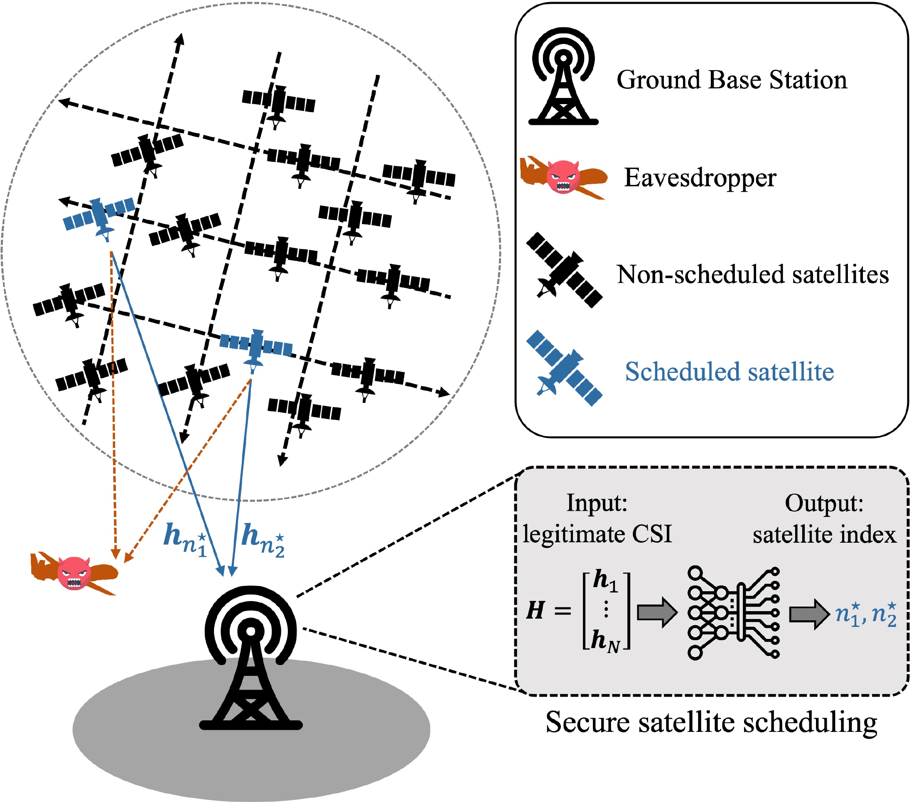

# SecureLEO: Secure Scheduling for LEO Satellite Networks

[](https://ieeexplore.ieee.org/)
[](https://www.python.org/)
[](https://pytorch.org/)
[](LICENSE)

Official implementation of **"Deep Learning-Based Secure Scheduling and Cooperative Artificial Noise Generation in LEO Satellite Networks"**

> **Authors:** Yongjae Lee (Student Member, IEEE), Taehoon Kim (Member, IEEE), Inkyu Bang (Member, IEEE), Erdal Panayirci (Life Fellow, IEEE), and H. Vincent Poor (Life Fellow, IEEE)
>
> **Submitted to:** IEEE Wireless Communications Letters (under review)

---

## Overview

SecureLEO is a deep learning-based **physical-layer security (PLS)** framework for LEO satellite communication networks. It jointly optimizes satellite scheduling and cooperative artificial noise (AN) generation using **Set Transformer** architecture, operating with only **statistical eavesdropper CSI**.

### Key Features

- **Set Transformer-Based Scheduling**: Permutation-invariant architecture that captures inter-satellite interactions for optimal subset selection
- **Cooperative AN Generation**: Non-data satellites transmit AN in the null space of legitimate channels to degrade eavesdropper reception
- **Statistical CSI Only**: No instantaneous eavesdropper CSI required — uses ergodic secrecy rate maximization via Monte Carlo sampling
- **Multi-Architecture Support**:
  - Set Transformer (default): Attention-based, permutation-invariant
  - Deep Sets: Lightweight baseline

### Performance Highlights

- **93–96% of genie-aided** secrecy rate (Set Transformer, 1M-trial GPU simulation)
- **Deep Sets baseline**: 64–68% of genie-aided — attention mechanism is essential
- **2.6–3.7x improvement** over random scheduling baseline
- **Sub-millisecond inference** vs. seconds for brute-force search
- Robust across varying system parameters ($N$, $K_d$, $M_e$, $K_{\text{AN}}$)

<p align="center">
  
</p>

---

## Project Structure

```
SecureLEO/
├── main.py                 # CLI entry point (train / evaluate / version)
├── pyproject.toml
├── requirements.txt
├── secureleo/               # Main package (flat, ~1500 lines)
│   ├── __init__.py         # Version & public API
│   ├── config.py           # YAML-based experiment configuration
│   ├── channel.py          # Shadowed-Rician fading channel generation
│   ├── signal.py           # Precoder + AN + SINR (ZF/MMSE) + Secrecy Rate
│   ├── scheduling.py       # Brute-force optimal + Random baseline
│   ├── models.py           # Set Transformer + Deep Sets
│   ├── dataset.py          # Environment + Dataset + Data generation
│   ├── trainer.py          # Training loop + Loss functions
│   └── benchmark.py        # Multi-baseline benchmarking + Plotting
├── experiments/
│   └── default.yaml        # Default experiment configuration
├── figures/                # Paper figures
└── supplementary/          # Additional experimental results & technical details
```

---

## Installation

### Requirements

```bash
# Clone the repository
git clone https://github.com/Yongjae-ICIS/SecureLEO.git
cd SecureLEO

# Create virtual environment
python -m venv .venv
source .venv/bin/activate  # Linux/macOS

# Install dependencies
pip install -r requirements.txt

# Or install as package
pip install -e .
```

### Dependencies

- Python >= 3.9
- PyTorch >= 1.12.0 (CUDA / MPS / CPU)
- NumPy, SciPy, Matplotlib
- typer, tqdm, PyYAML

---

## Usage

### Quick Start

```bash
# Train with default parameters
python main.py train --num-samples 40000 --num-epochs 12

# Train with YAML config
python main.py train --config experiments/default.yaml

# Evaluate a trained model
python main.py evaluate checkpoints/model.pt --num-trials 1000

# Check version & device
python main.py version
```

### Training

```bash
python main.py train \
    --num-samples 100000 \
    --num-epochs 12 \
    --batch-size 256 \
    --arch set_transformer \
    --embed-dim 128 \
    --num-heads 4 \
    --num-layers 2 \
    --lr 1e-3 \
    --mc-samples 100 \
    --device auto
```

### Command Line Arguments

| Argument | Description | Default |
|----------|-------------|---------|
| `--config` | Path to YAML config file | None |
| `--num-samples` | Training dataset size | 40000 |
| `--num-epochs` | Number of training epochs | 12 |
| `--batch-size` | Mini-batch size | 256 |
| `--arch` | Model: set_transformer or deep_sets | set_transformer |
| `--embed-dim` | Embedding dimension | 128 |
| `--num-heads` | Attention heads | 4 |
| `--num-layers` | Number of SAB layers | 2 |
| `--lr` | Learning rate | 1e-3 |
| `--mc-samples` | MC samples for ergodic rate | 100 |
| `--num-data-sats` | Data satellites ($K_d$) | 2 |
| `--device` | Device: auto, cpu, cuda, mps | auto |

### System Parameters

| Parameter | Symbol | Default | Description |
|-----------|--------|---------|-------------|
| Visible satellites | $N$ | 15 | LEO satellites in view |
| Scheduled satellites | $K$ | 10 | Selected for transmission |
| Data satellites | $K_d$ | 2 | Transmitting data |
| AN satellites | $K_{\text{AN}}$ | $K - K_d$ | Transmitting artificial noise |
| GBS antennas | $M_b$ | 2 | Zero-forcing receiver |
| Eve antennas | $M_e$ | 2 | MMSE receiver |
| Rician K-factor | $K_{\text{SR}}$ | 3 | Shadowed-Rician parameter |
| Nakagami m | $m$ | 5 | Shadowed-Rician parameter |

---

## Results

### Baseline Comparison (1M-Trial GPU Simulation, SNR = 10 dB)

| Config | $N$ | $K_d$ | $M_e$ | Proposed/Genie-Aided (%) | DeepSets/Genie-Aided (%) | Random/Genie-Aided (%) |
|--------|---|-----|-----|-------------------------|--------------------------|------------------------|
| N12_Kd2_Me2 | 12 | 2 | 2 | **93.6** | 64.2 | 40.8 |
| N15_Kd2_Me2 | 15 | 2 | 2 | **93.5** | 67.7 | 40.8 |
| N18_Kd2_Me2 | 18 | 2 | 2 | **93.5** | 65.5 | 40.8 |
| N15_Kd2_Me4 | 15 | 2 | 4 | **96.2** | 66.6 | 43.3 |

<p align="center">
  
  <br><em>Secrecy sum-rate comparison across N = {12, 15, 18}</em>
</p>

<p align="center">
  
  <br><em>Secrecy outage probability across N = {12, 15, 18}</em>
</p>

### Secrecy Rate Performance (Model / Genie-Aided)

| Configuration | $N$ | $K_d$ | $M_e$ | Model/Genie-Aided (%) |
|---------------|---|-----|-----|------------------|
| N12_Kd2_Me2 | 12 | 2 | 2 | 81.8 |
| N12_Kd2_Me4 | 12 | 2 | 4 | 75.5 |
| N15_Kd2_Me2 | 15 | 2 | 2 | 82.0 |
| N15_Kd2_Me4 | 15 | 2 | 4 | 75.3 |
| N15_Kd3_Me2 | 15 | 3 | 2 | 84.4 |
| N18_Kd2_Me2 | 18 | 2 | 2 | 82.3 |
| N18_Kd3_Me2 | 18 | 3 | 2 | 84.2 |

### CSI Gap Analysis

| SNR (dB) | Genie-Aided | Statistical | Model | Random | Statistical/Genie-Aided (%) |
|----------|--------|-------------|-------|--------|------------------------|
| 0 | 0.63 | 0.44 | 0.10 | 0.01 | 69.8 |
| 10 | 5.07 | 4.80 | 4.00 | 1.52 | 94.7 |
| 14 | 7.53 | 7.27 | 6.46 | 3.32 | 96.5 |
| 20 | 11.41 | 11.16 | 10.34 | 6.57 | 97.8 |

### Set Transformer Ablation Study

| Parameter | Value | Model/Genie-Aided (%) |
|-----------|-------|------------------|
| $d=64$ | $h=2, d=64, L=2$ | 81.7 |
| $d=128$ (default) | $h=4, d=128, L=2$ | 82.1 |
| $d=256$ | $h=4, d=256, L=2$ | 82.1 |
| $L=1$ | $h=4, d=128, L=1$ | 81.0 |
| $L=2$ (default) | $h=4, d=128, L=2$ | 81.9 |
| $L=3$ | $h=4, d=128, L=3$ | 82.2 |

---

## Supplementary Materials

Due to the page limitations of IEEE WCL, additional experimental results and technical details are provided in the [`supplementary/`](supplementary/) directory:

| Document | Description |
|----------|-------------|
| [Parameter Sensitivity Analysis](supplementary/parameter_sensitivity.md) | System parameter robustness across 12 configurations ($N$, $K_d$, $M_e$) |
| [Performance Gap Analysis](supplementary/performance_gap_analysis.md) | SNR-wise gap decomposition: CSI gap vs. algorithm gap |
| [Hyperparameter Ablation Study](supplementary/ablation_study.md) | Set Transformer architecture ablation ($d$, $h$, $L$) |
| [AN Satellite Configuration](supplementary/an_satellite_analysis.md) | Effect of AN satellite count ($K_{\text{AN}}$) on secrecy rate |
| [Convergence Analysis](supplementary/convergence_analysis.md) | Training convergence over 50 epochs with 5 random seeds |
| [AN Generation Protocol](supplementary/an_protocol.md) | Null-space computation and distributed AN protocol details |

---

## Citation

*Citation information will be added upon publication.*

---

## License

This project is licensed under the MIT License - see the [LICENSE](LICENSE) file for details.

---

## Acknowledgements

- **Set Transformer**: [Lee et al., ICML 2019](https://arxiv.org/abs/1810.00825) — Attention-based permutation-invariant architecture
- **Deep Sets**: [Zaheer et al., NeurIPS 2017](https://arxiv.org/abs/1703.06114) — Permutation-invariant baseline (without attention)
- **Physical-Layer Security**: Wyner's wiretap channel model and extensions

---

## Contact

For questions or issues, please open an issue or contact:
- Yongjae Lee: yjlee@edu.hanbat.ac.kr
- Inkyu Bang: ikbang@hanbat.ac.kr
