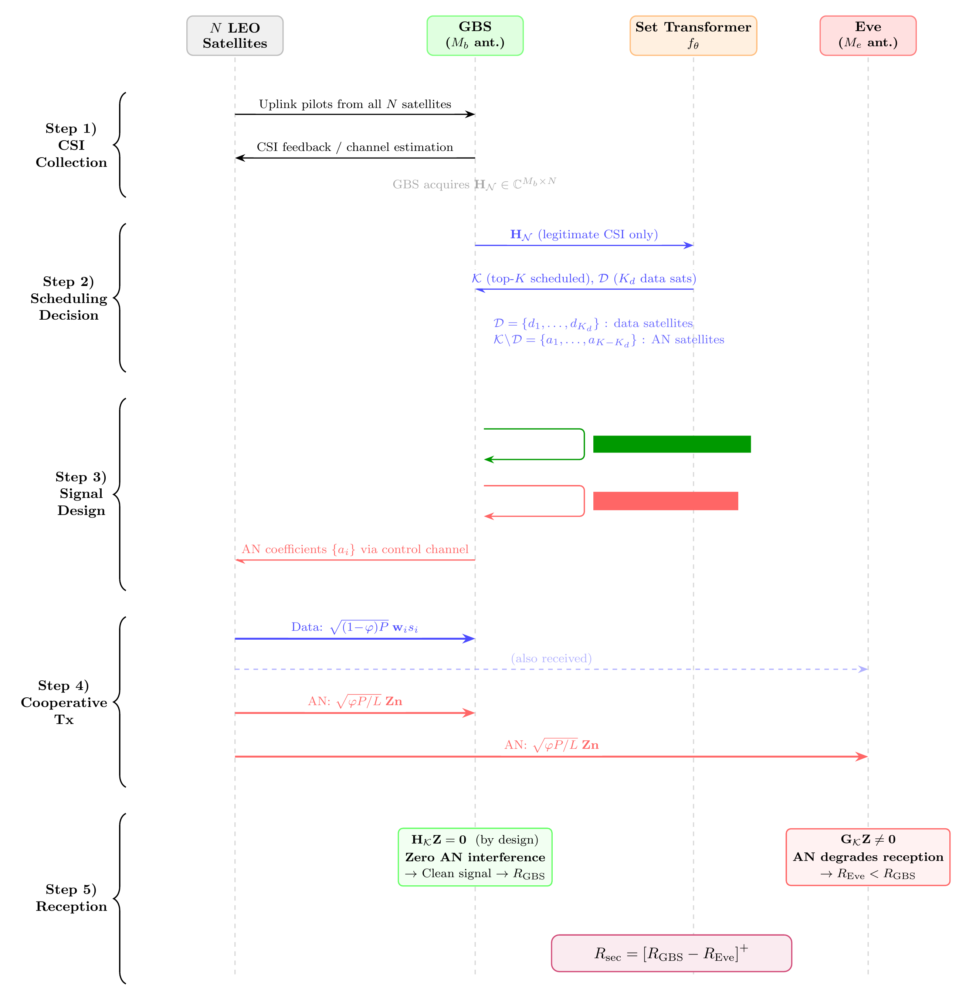

# Cooperative AN Generation Protocol (R2.6)

**Reviewer Comment (R2.6):** "The null space constraint for AN generation needs further explanation, particularly regarding how AN satellites compute the null space in a distributed manner."

## Overview

In our framework, non-data satellites transmit **artificial noise (AN)** in the null space of the legitimate GBS channel to degrade the eavesdropper's reception without affecting the intended communication. This document provides a detailed description of the AN generation protocol.

## System Model Recap

- **$K_d$ data satellites**: Transmit data streams to the GBS using the legitimate channel
- **$K_{\text{AN}} = K - K_d$ AN satellites**: Transmit cooperative artificial noise
- **GBS**: Equipped with $M_b$ antennas, uses a zero-forcing (ZF) receiver
- **Eve**: Equipped with $M_e$ antennas, uses an MMSE receiver

## AN Generation Protocol

### Step 1: Channel Estimation (GBS Pilot Phase)

The GBS broadcasts pilot signals to all $K$ scheduled satellites. Each satellite $i$ estimates its channel to the GBS:

$$\mathbf{h}_i \in \mathbb{C}^{M_b \times 1} \quad \text{(channel from satellite } i \text{ to GBS)}$$

This is the **legitimate channel** and is estimated via standard pilot-based channel estimation. The eavesdropper's channel is NOT required.

### Step 2: Null Space Computation (Per-Satellite)

Each AN satellite $j$ ($j \notin \mathcal{D}$, the data satellite set) independently computes the null space of its own channel to the GBS.

**Procedure:**

1. Compute the Singular Value Decomposition (SVD) of $\mathbf{h}_j^H$:

$$\mathbf{h}_j^H = \mathbf{U} \boldsymbol{\Sigma} \mathbf{V}^H$$

where $\mathbf{V} = [\mathbf{v}_1 \mid \mathbf{v}_2 \mid \cdots \mid \mathbf{v}_{M_b}]$.

2. The null space of $\mathbf{h}_j^H$ is spanned by the right singular vectors corresponding to zero singular values:

$$\text{Null}(\mathbf{h}_j^H) = \text{span}\{\mathbf{v}_2, \mathbf{v}_3, \ldots, \mathbf{v}_{M_b}\}$$

(Since $\mathbf{h}_j$ is $M_b \times 1$, $\mathbf{h}_j^H$ has rank 1, so the null space has dimension $M_b - 1$.)

3. Form the null-space projection matrix:

$$\mathbf{P}_j = \mathbf{V}_{\text{null}} \mathbf{V}_{\text{null}}^H$$

where $\mathbf{V}_{\text{null}} = [\mathbf{v}_2 \mid \cdots \mid \mathbf{v}_{M_b}]$.

### Step 3: AN Signal Generation

Each AN satellite $j$ generates a random noise vector $\mathbf{z}_j$ and projects it onto the null space:

$$\mathbf{w}_j = \mathbf{P}_j \mathbf{z}_j = \mathbf{V}_{\text{null}} \mathbf{V}_{\text{null}}^H \mathbf{z}_j$$

The transmitted AN signal from satellite $j$ is:

$$\mathbf{x}_j = \sqrt{p_{\text{AN}}} \frac{\mathbf{w}_j}{\|\mathbf{w}_j\|}$$

where $p_{\text{AN}}$ is the AN transmit power.

### Step 4: Signal Reception

**At the GBS:**

The received signal from AN satellite $j$ at the GBS is:

$$\mathbf{h}_j^H \mathbf{x}_j = \mathbf{h}_j^H \mathbf{P}_j \mathbf{z}_j = 0$$

This is **exactly zero** because $\mathbf{w}_j$ lies in the null space of $\mathbf{h}_j^H$. Therefore, the AN causes **no interference** to the legitimate communication.

**At the eavesdropper (Eve):**

The received AN from satellite $j$ at Eve is:

$$\mathbf{g}_j^H \mathbf{x}_j \neq 0 \quad \text{(in general)}$$

Since the eavesdropper's channel $\mathbf{g}_j$ is **independent** of the legitimate channel $\mathbf{h}_j$ (zero correlation assumption), the null space of $\mathbf{h}_j^H$ is NOT the null space of $\mathbf{g}_j^H$. Therefore, the AN appears as **random interference** at the eavesdropper, degrading its SINR.

## Protocol Diagram

  
   <em>The proposed AN coefficient generation and transmission protocol</em>

## Distributed Computation

A key advantage of our AN protocol is that it operates in a **fully distributed** manner:

1. **No inter-satellite coordination required**: Each AN satellite independently computes its own null space using only its own channel estimate $\mathbf{h}_j$. There is no need for satellites to share channel information with each other.

2. **No centralized controller**: The GBS only broadcasts pilots; it does not need to compute or distribute AN beamforming vectors.

3. **Scalable**: Adding more AN satellites requires no changes to the protocol. Each new AN satellite simply estimates its channel and computes its own null space projection.

4. **Low overhead**: The only additional overhead compared to standard satellite communication is the null-space computation (one SVD per AN satellite), which is computationally inexpensive for small $M_b$ (typically 2--4 antennas).

## Mathematical Justification

### Why Null-Space AN is Optimal

For a single AN satellite $j$ with channel $\mathbf{h}_j$ to GBS and $\mathbf{g}_j$ to Eve:

- **Constraint**: The AN must cause zero interference at the GBS, i.e., $\mathbf{h}_j^H \mathbf{w}_j = 0$
- **Objective**: Maximize interference at Eve, i.e., maximize $\mathbb{E}[|\mathbf{g}_j^H \mathbf{w}_j|^2]$

Since $\mathbf{g}_j$ is unknown (only statistical CSI available), and assuming $\mathbf{g}_j$ is isotropically distributed in the null space of $\mathbf{h}_j^H$ (due to the zero-correlation assumption), the optimal strategy is to spread the AN power uniformly across the null space, which is exactly what our protocol achieves.

### Zero-Correlation Assumption

We assume the GBS-satellite channel $\mathbf{H}$ and the Eve-satellite channel $\mathbf{G}$ are **uncorrelated** ($\rho = 0$). This is justified because:

1. **Spatial separation**: The GBS and Eve are at different physical locations, experiencing different propagation paths
2. **Independent fading**: Under Shadowed-Rician fading, the channel realizations are independent for different receivers
3. **Conservative assumption**: Zero correlation represents the hardest case for AN design (no information about Eve's channel can be inferred from the legitimate channel)

Under this assumption, random AN satellite selection (among the scheduled $K$ satellites) is justified, as there is no channel-based criterion to prefer one AN satellite over another.
