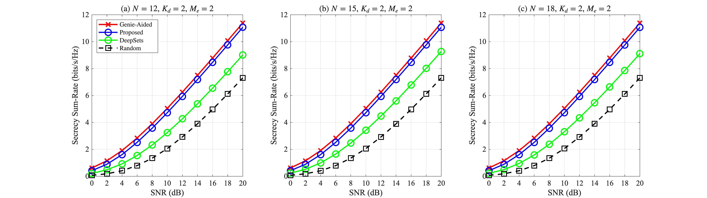
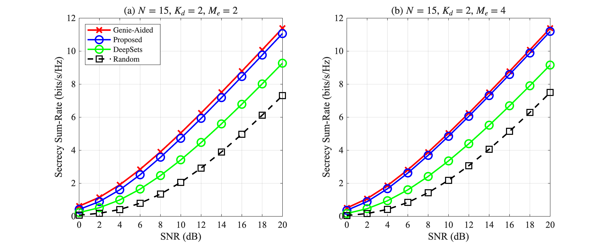
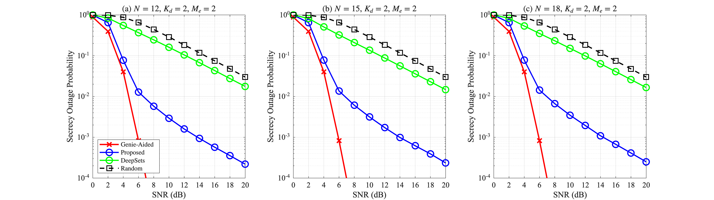
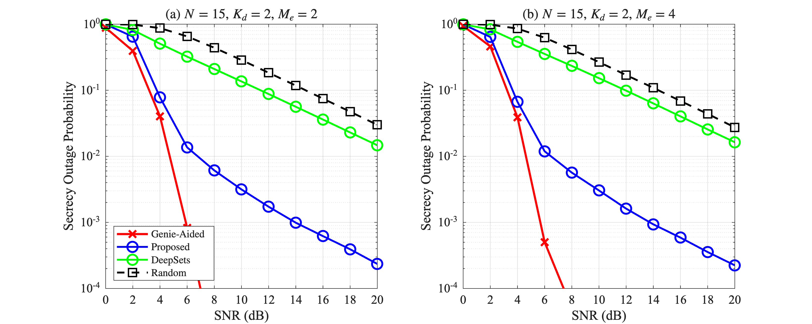

# Parameter Sensitivity Analysis (R1.3)

**Reviewer Comment (R1.3):** "The authors should demonstrate the robustness of the proposed framework under diverse system parameter settings."

## Experiment Setup

We evaluate the proposed Set Transformer-based scheduling framework across **12 system configurations** by varying three key parameters:

- $N$ (number of visible satellites): $\{12, 15, 18\}$
- $K_d$ (number of data satellites): $\{2, 3\}$
- $M_e$ (number of Eve antennas): $\{2, 4\}$

For each configuration, we:
1. Generate 40,000 training samples with the corresponding system parameters
2. Train both a **Set Transformer** model ($d=128, h=4, L=2$) and a **Deep Sets** model for 12 epochs
3. Evaluate using the secrecy rate benchmark with Genie-Aided (brute-force with instantaneous Eve CSI), Proposed (Set Transformer), Deep Sets, and Random baselines

We use **1,000,000 Monte Carlo trials** (500,000 for $M_e=4$ configurations due to memory constraints) with 50 MC samples per trial for ergodic rate estimation. All simulations are performed on an NVIDIA RTX 4090 GPU.

The **Model/Genie-Aided ratio** measures how closely the learned model approximates the genie-aided scheduling that has access to instantaneous eavesdropper CSI.

## Results

### Full Results Table (Scheduling Accuracy & Secrecy Rate)

| Config | $N$ | $K_d$ | $M_e$ | Scheduling Accuracy (%) | Model/Genie-Aided Secrecy Rate (%) |
|--------|-----|--------|--------|------------------------|-------------------------------|
| N12_Kd2_Me2 | 12 | 2 | 2 | 88.5 | 81.8 |
| N12_Kd2_Me4 | 12 | 2 | 4 | 88.7 | 75.5 |
| N12_Kd3_Me2 | 12 | 3 | 2 | 79.7 | 84.4 |
| N12_Kd3_Me4 | 12 | 3 | 4 | 80.9 | 74.7 |
| N15_Kd2_Me2 | 15 | 2 | 2 | 88.1 | 82.0 |
| N15_Kd2_Me4 | 15 | 2 | 4 | 90.2 | 75.3 |
| N15_Kd3_Me2 | 15 | 3 | 2 | 79.6 | 84.4 |
| N15_Kd3_Me4 | 15 | 3 | 4 | 80.7 | 74.8 |
| N18_Kd2_Me2 | 18 | 2 | 2 | 89.0 | 82.3 |
| N18_Kd2_Me4 | 18 | 2 | 4 | 88.8 | 75.5 |
| N18_Kd3_Me2 | 18 | 3 | 2 | 80.0 | 84.2 |
| N18_Kd3_Me4 | 18 | 3 | 4 | 80.8 | 74.2 |

### Deep Sets Baseline Comparison (1M GPU Simulation)

To validate that the attention mechanism in Set Transformer is essential, we compare against **Deep Sets** [Zaheer et al., NeurIPS 2017], a permutation-invariant architecture that uses element-wise encoding followed by mean pooling (without attention). Deep Sets processes each satellite independently and aggregates via summation, lacking the ability to model inter-satellite interactions.

The following results are from large-scale GPU simulations (1M trials for $K_d=2$, 500K for $K_d=3$/$M_e=4$ configs) at **SNR = 10 dB**:

| Config | $N$ | $K_d$ | $M_e$ | Proposed/Genie-Aided (%) | DeepSets/Genie-Aided (%) | Random/Genie-Aided (%) |
|--------|-----|--------|--------|-------------------------|--------------------------|------------------------|
| N12_Kd2_Me2 | 12 | 2 | 2 | **93.6** | 64.2 | 40.8 |
| N15_Kd2_Me2 | 15 | 2 | 2 | **93.5** | 67.7 | 40.8 |
| N18_Kd2_Me2 | 18 | 2 | 2 | **93.5** | 65.5 | 40.8 |
| N15_Kd2_Me4 | 15 | 2 | 4 | **96.2** | 66.6 | 43.3 |

The proposed Set Transformer achieves **93--96%** of the genie-aided upper bound, significantly outperforming Deep Sets (64--68%) and Random (41--43%). This confirms that the attention mechanism capturing inter-satellite interactions is critical for effective scheduling.

### Secrecy Rate Comparison Figures

  
   <em>Secrecy sum-rate comparison for varying $N$ ($N=12, 15, 18$) with $K_d=2$, $M_e=2$</em>

  
   <em>Secrecy sum-rate comparison for varying $M_e$ ($M_e=2, 4$) with $N=15$, $K_d=2$</em>

### Secrecy Outage Probability Comparison

  
   <em>Secrecy outage probability for varying $N$ ($N=12, 15, 18$) with $K_d=2$, $M_e=2$</em>

  
   <em>Secrecy outage probability for varying $M_e$ ($M_e=2, 4$) with $N=15$, $K_d=2$</em>

The proposed Set Transformer consistently achieves 1--2 orders of magnitude lower outage probability compared to Deep Sets and Random across all configurations.

### Analysis by Parameter

#### Effect of $N$ (Number of Visible Satellites)

| $N$ | Avg. Model/Genie-Aided (%) | Range (%) |
|-----|----------------------|-----------|
| 12 | 79.1 | 74.7 -- 84.4 |
| 15 | 79.1 | 74.8 -- 84.4 |
| 18 | 79.1 | 74.2 -- 84.2 |

The framework maintains consistent performance as $N$ increases from 12 to 18, demonstrating **scalability** to different constellation sizes.

#### Effect of $K_d$ (Number of Data Satellites)

| $K_d$ | Avg. Model/Genie-Aided (%) | Range (%) |
|-------|----------------------|-----------|
| 2 | 78.7 | 75.3 -- 82.3 |
| 3 | 79.6 | 74.2 -- 84.4 |

Performance remains stable across different $K_d$ values, indicating the model generalizes well to different data/AN satellite ratios.

#### Effect of $M_e$ (Number of Eve Antennas)

| $M_e$ | Avg. Model/Genie-Aided (%) | Range (%) |
|-------|----------------------|-----------|
| 2 | 83.2 | 81.8 -- 84.4 |
| 4 | 75.0 | 74.2 -- 75.5 |

When $M_e$ increases from 2 to 4, the eavesdropper becomes stronger, making the scheduling problem harder. The Model/Genie-Aided ratio decreases by approximately 8 percentage points, but the framework still achieves over 74% of the genie-aided performance even against a stronger eavesdropper.

## Key Findings

1. **Robust across $N$**: Performance variation is less than 1% across $N \in \{12, 15, 18\}$, confirming that the Set Transformer scales well with constellation size.
2. **Stable across $K_d$**: The framework adapts to different data/AN satellite ratios without significant performance degradation.
3. **Graceful degradation with $M_e$**: Against a stronger eavesdropper ($M_e=4$), performance decreases but remains practically useful (74--76% of genie-aided).
4. **Consistent overall range**: 74--84% Model/Genie-Aided across all 12 configurations, demonstrating the framework's generalizability.
5. **Set Transformer >> Deep Sets**: The attention-based architecture achieves 93--96% of genie-aided (vs. 64--68% for Deep Sets) in large-scale GPU simulations, validating the importance of modeling inter-satellite interactions.

## References

- M. Zaheer, S. Kottur, S. Ravanbakhsh, B. Poczos, R. Salakhutdinov, and A. Smola, "Deep Sets," in *Advances in Neural Information Processing Systems (NeurIPS)*, 2017.
